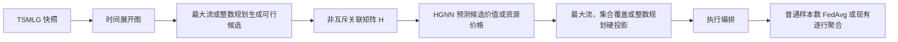

# 超图与 HGNN 联邦学习编排设计

## 文档定位

本文汇总围绕 HFLSnF、TSMLG、非互斥超图、超图神经网络（HGNN）以及联邦学习编排控制的完整讨论，并给出面向后续实验的统一设计。

本文同时涉及三个工程：

- `HFLSnF_KG_v3`：用于理解“更多客户端参与与更高 MRR”的现象，并提供聚合等价性、动态拓扑回放和参与审计经验；
- `HFLSnF_dynEdge`：当前 FEMNIST 普通联邦学习共识实验和未来拓扑编排的主要落地点；
- `Topo_opt`：TSMLG 生成、时间展开图、最大流和动态边缘节点启发式的 MATLAB 来源。

本文是研究与实现设计，不表示所述 HGNN、下行多播、缓存、故障恢复或事件驱动模拟已经在当前训练器中完成。

---

## 1. 核心结论

### 1.1 超图不应继续用于学习聚合权重

已经有实验表明，直接使用超图或 HGNN 修改联邦聚合权重没有稳定收益。当前 KGE V3 的逐行出现次数加权在严格条件下满足分层合并与直接合并的等价性，测试见 [`tests/test_row_count_aggregation.py`](tests/test_row_count_aggregation.py)。这里的“等价”只表示：同一轮初全局状态、同一批客户端更新和同一组逐行分子/分母，在客户端分组互斥、组内与跨组均不重复时，先在边缘累计再合并与直接累计得到相同的 FedAvg 候选状态。

它不表示四个实验臂端到端等价，也不允许把一个客户端更新沿非互斥超边重复聚合。若服务器继续使用 FedAdam，只有 FedAvg 候选状态、轮初全局状态和服务器优化器状态都相同，后续服务器状态才应相同。因此：

- 非互斥 $H_t$ 只表达调度前候选关系；
- 执行集合 $S_t$ 中每个 `client_id` 只能出现一次；
- 聚合前必须按真实 `client_id` 去重并拒绝重复贡献；
- 应增加隔离测试：固定 $S_t$、本地随机种子和缓存更新，对比直接聚合、随机互斥分组和 MAT 互斥分组，逐轮检查 FedAvg 候选哈希与 FedAdam 状态哈希。

因此，后续应保持：$w_{t+1}=\frac{\sum_{i\in S_t}n_iw_{t,i}}{\sum_{i\in S_t}n_i}$

或当前 KGE 的逐行出现次数加权规则不变。

超图和 HGNN 只决定：

- 谁获得训练或观测机会；
- 走哪条路径；
- 使用哪个中继；
- 在哪个时隙或波次发送；
- 分配多少通信、计算和冗余资源；
- 何时关闭聚合窗口；
- 发生故障后如何切换；
- 全局模型如何下发。

### 1.2 最大流和 HGNN 应分工，而不是互相替代

推荐采用“精确可行性 + 学习型择优”的混合框架：



- 最大流、最小费用流或整数规划负责容量、流守恒、截止时间和唯一客户端约束；
- HGNN 负责在多个同样可行的方案中，根据公平、学习覆盖、时延、能耗和风险择优；
- 神经网络不能凭软惩罚替代硬容量约束。

### 1.3 最推荐的研究主线

最有说服力的第一条主线是：

> 固定客户端集合与本地更新，利用容量—故障域时序超图，让 HGNN 编排主备路由、上传波次和截止时间，并由精确优化器保证可行性。

第二条主线是：

> 在有限查询预算下主动探测客户端和链路状态，用 HGNN 维护不完全观测下的共识与网络状态，再驱动下一轮编排。

第三条主线是：

> 固定客户端集合和模型版本，利用时序超图编排全局模型的中继暂存、多播和下行分发。

---

## 2. 当前代码事实与需要先修正的实验口径

### 2.1 当前 FEMNIST 普通 FL 只使用 MAT 中的参与人数

当前配置使用：

```yaml
topology_assignment_mode: "balanced_counts"
```

见 [`femnist_fl_snf_u05_5000.yaml`](../HFLSnF_dynEdge/FEMNISTProbe/configs/femnist_fl_snf_u05_5000.yaml)。

普通 FL 的 `balanced_counts` 分支只根据 MAT 中的参与人数构造：

$
\{0,1,\ldots,n_t-1\}
$

见 [`topology_schedule.py`](../HFLSnF_dynEdge/topology_schedule.py)。当前活动配置读取的是后处理后的 `result-U-6fixedge_epoch200_varAlpha_0p1_trainable.mat`，因此完整数据流应写成：

```text
源 TSMLG 与 CommonFL_v3 最大流
→ 源 MAT
→ 零人数填补与 varAlpha 人数控制
→ 运行时 MAT 中每轮参与人数 n_t
→ 固定 37 个候选槽位的前 n_t 个
→ 本地训练
→ 样本数 FedAvg
```

普通 FL 即使 YAML 写有 `topology_edge_mode: fixed`，也会在调度加载时归一化为 `none`；`LocalSearch_EdgeSet_v6` 的动态边缘启发式只用于 HFL，不是当前普通 FL 选择链的一部分。

当前路径没有消费：

- 运行时 MAT 中重建后的 `c2cmap` 客户端身份；
- 客户端实际路径；
- 共享链路；
- 中继或时隙；
- TSMLG 原始容量。

正式训练器还强制要求 37 个候选、250 个逻辑客户端和 `balanced_counts`，见 [`trainer.py`](../HFLSnF_dynEdge/FEMNISTProbe/trainer.py)。

这会产生固定前缀偏置。在当前 $u=0.5$ 的 200 行运行 MAT 中，FL-SnF 每轮为 20 至 31 人，槽位 0 至 19 每轮出现而 31 至 36 从不出现；FL-noSnF 每轮为 5 至 10 人，槽位 0 至 4 每轮出现而 10 至 36 从不出现。做超图编排前，至少应加入以下基线：

1. 当前固定前缀；
2. 运行时 MAT 的重建 `c2cmap` 身份；
3. 同人数随机轮转；
4. 同人数随机可行最大流；
5. 最小费用最大流。

第 2 项只用于消除 Python 前缀偏置，仍不是“真实拓扑身份”基线。若要恢复源最大流身份，必须从未后处理的源 MAT 或重新生成的路径证书中取得并验证。

### 2.2 `HFLSnF_KG_v3` 当前执行链与 MAT 来源

KGE V3 的正式 HFLSnF 配置见 [`formal_dynamic_mat_hflsnf_seed42_150round_cuda.yaml`](configs/formal_dynamic_mat_hflsnf_seed42_150round_cuda.yaml)，其关键设置是：

```text
matlab_direct
→ HFL
→ SnF=true
→ 固定 6 个边缘节点
→ 37 个候选客户端上限
→ row_count_weighted
→ server FedAdam
```

Python 运行时通过 [`MatlabTopologySchedule`](core/matlab_topology_schedule.py) 回放 MAT 中的活跃身份与互斥分组；每个活跃客户端从同一个轮初全局状态训练，见 [`dynamic_trainer.py`](fedml_kge/dynamic_trainer.py)。当前运行时没有重新执行最大流，也没有 HGNN。

正式配置使用的 `result-U-6fixedge_epoch200_varAlpha_0p1_trainable.mat` 还不是未经修改的原始最大流结果。[`build_trainable_varalpha_mat.m`](../../Topo_opt/postprocess/build_trainable_varalpha_mat.m) 先填补零客户端轮次，再控制人数方差，并按目标人数裁剪或从合法客户端池补入身份后重建映射。当前文件元数据记录了 627 个零值替换。补入身份时没有重新求解最大流，也没有重新验证路径容量，因此：

- 当前“更多客户端参与”是 MAT 已编码并经后处理的调度结果；
- 当前运行时不能被描述为 HGNN 或在线最大流产生了这些客户端；
- trainable MAT 的重建映射不能直接当作最大流认证的路径证书；
- 第 4 章的“最大流认证候选超边”是未来新增方案，而不是现有 MAT 已有性质。

KGE V3 中“更多参与客户端与更高 MRR”目前应视为特定配置和运行中的描述性现象。要识别因果效应，仍需固定客户端身份、更新和服务器状态，分别隔离参与人数、客户端覆盖、HFL 分组以及服务器优化器的影响。

### 2.3 当前 MAT 不足以恢复完整拓扑

[`Topo_opt/test1.m`](../Topo_opt/test1.m) 当前源码的重新生成输出可以保存人数、分组、映射、层数、时间参数、派生聚合时延统计、拓扑种子和 `topology_sampling_info` 等摘要，但没有逐快照保存完整 `TSML_BdwMat`、真实连续时间轴或稀疏的路径—资源关联。当前正式训练使用的 trainable MAT 连 `topology_sampling_info` 都没有；必须区分“当前源码重新生成时能够写出的摘要”和“当前活动 MAT 实际包含的字段”。

因此，仅凭当前训练 MAT 无法恢复：

- 哪些客户端路径共享同一链路时隙；
- 哪些路径属于同一相关故障域；
- 每个候选方案的资源负载；
- 主备路径和多播树；
- 下行容量和到达时间。

未来至少应额外导出原始 TSMLG，或者直接导出候选路径、候选流和资源占用证书。

### 2.4 当前 200 行 MAT 不是连续 200 时刻

`test1.m` 为每个 epoch 使用独立随机种子生成网络快照。每个快照内部的 8 层具有时间含义，但相邻 MAT 行并不是同一网络的连续状态。trainable MAT 的零值填补可能引用上一行或首个非零行，方差控制也会重建映射；这是人工后处理产生的跨行依赖，不是真实网络状态连续演化。

因此当前可以严谨研究：

- 单个 TSMLG 快照内部的多时隙存储转发；
- 单快照内的波次、截止时间和主备路径；
- 多个独立快照之间的泛化。

当前不能直接声称：

- 跨 MAT 行预测网络演化；
- 跨轮持续队列动态；
- 基于连续网络轨迹的预测缓存；
- 真正的长期拓扑模型预测控制。

若要做时序 HGNN、缓存预测或跨轮队列控制，应重新生成连续 TSMLG trace，并按完整 trace 划分训练、验证和测试。

---

## 3. 超图关联矩阵的正确语义

### 3.1 列数表示超边数，不表示物理资源数

超图关联矩阵记为：

$
H\in\mathbb R^{|V|\times|\mathcal E|}
$

- 行对应顶点；
- 列对应超边；
- `H[i,e]` 表示顶点 $i$ 是否属于超边 $e$，或表示带权关联强度。

此前把“链路—时隙资源数量”直接描述成超图列数是不准确的。资源数量只有在“资源本身被定义为超边”时才可能成为列数；若顶点是客户端、超边是候选协同集合，那么列数就是候选集合数量。

### 3.2 最终分配矩阵不等于候选关联矩阵

现有最大流最终解和客户端到边缘节点映射属于执行决策：

$
X_t[i,g]=1
\iff
\text{客户端 }i\text{ 最终分配给中继 }g
$

由于一个客户端每轮最多训练和上传一次：

$
\sum_gX_t[i,g]\le1
$

所以每行至多一个非零是合理的，但它只是互斥执行方案，不是非互斥候选超图。

必须区分：

- $H_t$：调度前的非互斥候选关系；
- $X_t$：调度后的互斥执行动作。

HGNN不能从退化的 one-hot 分组矩阵中凭空恢复已经丢失的替代路径和共享资源关系。

---

## 4. 从 TSMLG 构造非互斥超图

### 4.1 TSMLG 的物理含义

TSMLG 是有向加权时隙多层图：

$
T_t\in\mathbb N^{N\times N\times L}
$

当前 Metro 实验为：

- 38 个物理节点；
- 1 个云节点和 37 个非云节点；
- 8 个时间层；
- 元素表示有向链路在相应层可用的波长容量。

[`tsmlg2adj.m`](../Topo_opt/tsmlg2adj.m) 将其转换为时间展开图，并在相邻层之间加入同节点存储转发边。

TSMLG 中的数值是容量，不是路径代价。若要优化时延、能耗或可靠性，需要额外定义相应成本。

### 4.2 方案一：最大流认证的候选调度超图

这是最适合“每列就是一个完整候选客户端集合”的构造。

第 $t$ 个快照先求最大参与人数：

$
N_t^*=\operatorname{MaxFlow}(G_t^T)
$

只有在“单位流合同”下，最大流值才等于客户端人数：虚拟源到每个客户端的容量为 1，每个客户端具有一个不可分割的整数单位需求，网络容量为整数，并且全部客户端流向共同汇点。若引入真实模型字节、不同压缩率或不同客户端负载，应改为求带需求的最大基数可行集合 $K_t^*$，不能再把原始流量值直接解释为客户端数。

然后通过随机费用扰动、客户端优先级、最小时延、最大公平、故障扰动和多样性惩罚，生成多个不同但等人数的最大流解：

$
\mathcal F_t=\{(S_{t,1},F_{t,1}),\ldots,(S_{t,M_t},F_{t,M_t})\}
$

每个解满足：

$
|S_{t,m}|=N_t^*,
\qquad
F_{t,m}\text{ 满足全部容量约束}
$

以 37 个候选客户端为顶点，每个完整可行集合形成一条超边：$e_{t,m}=S_{t,m}$

关联矩阵：$H_t^{cohort}[i,m]=\mathbf 1[i\in S_{t,m}]$

一个客户端可以出现在多条可行超边中，所以一行可以有多个非零。

每条候选的身份是 $(S_{t,m},F_{t,m})$，必须同时保存完整路径与资源占用证书。只保存客户端集合会导致相同成员但不同路由的方案无法区分。两个候选的 $H$ 列可以完全相同，只要其路径证书、超边特征或关联特征不同。

候选池建议：

- $M\in\{16,32,64\}$ 做消融；
- 只保留人数为 $N_t^*$ 的方案，排除参与人数混杂；
- 只有客户端集合和路径资源证书都相同时才删除重复候选；
- 多样性距离同时考虑客户端集合 $S_m$ 与已占用资源集合 $Q_m$：

$d(m,n)=\alpha\bigl(1-J(S_m,S_n)\bigr)+(1-\alpha)\bigl(1-J(Q_m,Q_n)\bigr)$

- 不能只按客户端集合 Jaccard 去重，否则会误删“同一批客户端、不同路径”的有效候选；
- 保存候选生成器类型和随机扰动种子；
- 执行前重新验证容量证书。

### 4.3 方案二：客户端—候选路径资源冲突超图

若希望直接控制路径，顶点应改为客户端—路径选项：$z_{i,r}=(i,P_{i,r})$

每个链路—时隙资源形成一条容量超边：

$e_q=\{z_{i,r}\mid q\in P_{i,r}\}$

关联矩阵：$H_t^{res}[z_{i,r},q]=\mathbf 1[q\in P_{i,r}]$

一条路径经过多个资源，所以每行天然有多个非零；多个客户端路径共享同一资源，所以每列也会连接多个顶点。

调度变量为：$y_{i,r}\in\{0,1\}$

约束：

$
\sum_ry_{i,r}\le1
$

$\sum_{i,r:q\in P_{i,r}}d_iy_{i,r}\le C_t(q)$

其中 $d_i$ 是客户端更新负载。当前最大流将其固定为 1；加入模型字节数或压缩后，应使用真实负载。

### 4.4 方案三：机会超图

也可以定义中继—时间窗机会超边：$e_{g,\tau}=\{i\mid i\text{ 可经中继 }g\text{ 并在 }\tau\text{ 前完成}\}$

一个客户端可以到达多个中继和多个时间窗，所以非互斥性自然成立。

这种构造适合：

- 中继启停；
- 覆盖公平；
- 候选缩减；
- 客户端—中继分配。

但它只表达个体可达性，不保证所有成员同时发送时仍满足共享容量，因此必须再经过最大流或整数规划修复。

### 4.5 多视图超图

可以建立多种相互补充的超图：

- $H^{net}$：共享链路、可达中继、时间窗和路径；
- $H^{data}$：客户端标签类别、稀有类别和数据规模区间；
- $H^{pred}$：客户端历史预测模式、共同错误和互补分歧；
- $H^{fault}$：共享物理链路、中继、区域和故障域；
- $H^{version}$：持有相同模型版本或缺失相同模型块的接收端。

推荐使用多分支编码后融合，而不是把所有关系无差别拼成一个稠密矩阵。

---

## 5. 超图在不使用 HGNN 时可以做什么

### 5.1 客户端准入与路径联合选择

保持每轮最大参与人数 $N_t^*$，在多个最大流等价解中优化：

- 跨轮公平；
- 类别覆盖；
- 历史更新多样性；
- 时延和能耗；
- 故障风险；
- 路由切换成本。

### 5.2 上传波次和容量超图着色

固定客户端和路径后，对共享链路时隙的客户端分波次：

$
\sum_{i:q\in P_i,\ wave_i=s}d_i
\le C_{q,s}
$

容量超图比普通冲突图更自然。例如容量为 5 时，前 5 个客户端可以共存，第 6 个才产生冲突；普通二元冲突边无法无损表达这种阈值关系。

### 5.3 跨轮公平和防饥饿

利用客户端超度：

$
d_i(t)=\sum_eH_t[i,e]
$

超度低表示当前可行机会稀缺，可以优先分配。还可以维护：

- 距上次参与轮数；
- 滑动窗口参与次数；
- 最大连续未参与轮数；
- Jain 指数和参与 Gini。

### 5.4 主备路径和故障恢复

一个客户端保留多条候选路径，利用故障超图避免主备路径落入同一故障域。执行时仍只有一条主路径，备份只在失败后激活。

### 5.5 主动共识探针

当前未参与客户端在探针记录中使用训练前云模型代填，见 [`trainer.py`](../HFLSnF_dynEdge/FEMNISTProbe/trainer.py)。这不是客户端当前真实信号。

可以新增 `probe_only_client`：不训练，只返回低成本信号，例如：

- 本地 loss；
- 类别级 loss；
- 梯度范数或低维草图；
- 小规模调度探针 logits；
- 预测熵；
- 历史签名变化。

以类别、行为簇、错误类型和拓扑区域形成观测超边，在固定探针预算下最大化信息覆盖并降低信号年龄。

正式测试集不能用于在线调度，应另设 scheduling/calibration probe。

---

## 6. 引入 HGNN 的推荐方式

### 6.1 首选：候选超边排序器

对最大流认证的候选调度超图，先做节点—超边—节点传播：$X'=\sigma\left(D_v^{-1/2}HWD_e^{-1}H^\top D_v^{-1/2}X\Theta\right)$

该式只消费二值关联，应明确作为基础 HGNN 基线。计算 $D_v^{-1/2}$ 时，只对超度大于零的客户端归一化；零超度客户端应使用 mask、残差自环或单独编码，不能直接求逆。

完整模型应消费客户端—候选关联路径特征 $r_{i,e}$，例如使用二部注意力：

$m_e=\sum_iH[i,e]\,\alpha_{i,e}\,\phi_v([x_i,r_{i,e}])$

$x_i'=\phi_x\left([x_i,\sum_eH[i,e]\,\beta_{i,e}\,\phi_e([m_e,r_{i,e}])]\right)$

这样，相同成员但不同路径证书的两条候选超边仍可由关联特征和超边特征区分。

再构造超边嵌入：

$Z_e=D_e^{-1}H^\top X'$

输出每条候选超边的调度分数：

$s_e=\operatorname{MLP}([Z_e,z_e,g_t])$

运行时：$e_t^*=\arg\max_{e\in\mathcal E_t^{feasible}}s_e$

候选已经通过最大流认证，因此选择任意候选都不会违反容量。

### 6.2 更强版本：HGNN 打分 + 固定流量最小费用最大流

HGNN输出客户端分数 $s_i$ 和路径分数 $a_{i,r}$。客户端分数可以直接写入流网络费用：

$
cost(source\rightarrow client_i)=-s_i
$

然后固定求恰好 $N_t^*$ 单位流。

任意路径级分数不能只靠 `source→client` 这一条边表达。路径分数必须通过以下一种方式进入投影：

- 为每个客户端—候选路径建立选项节点，并在选择弧上赋费用 $-a_{i,r}$；
- 使用路径变量 $y_{i,r}$ 的整数规划；
- 仅在路径分数可严格分解为物理链路加性费用时，把分数分摊到链路弧。

这相当于词典序优化：

1. 第一目标保持最大参与人数；
2. 第二目标最大化神经网络预测的长期价值。

不需要可微分最大流，也不会产生软容量违规。

### 6.3 输入特征

#### 客户端特征

- `log(sample_count)`；
- 标签数、标签熵和类别分布低维草图；
- 距上次参与轮数；
- 滑动窗口参与次数；
- 历史按时完成率和失败率；
- 上次真实本地 loss；
- 上次更新范数；
- 历史探针分歧度和信号年龄；
- 当前可行路径数量；
- 最短、平均和 P95 路径时延；
- 最早到达层和瓶颈容量。

当前轮训练后才得到的更新特征不能用于当前轮选择。未参与客户端的云模型代填结果也不能当作真实本地信号。

#### 超边特征

- 参与人数；
- 最大、平均和 P95 到达层；
- 总跳数和存储转发次数；
- 最小容量余量；
- 最大链路时隙利用率；
- 瓶颈资源数；
- 路径重叠程度；
- 单链路失效后的可完成人数；
- 与上一轮方案的 Jaccard 距离；
- 路由和中继切换成本；
- 选中后的 Jain 指数和最大 staleness；
- 类别覆盖和历史更新方向多样性。

#### 关联特征

仅使用二值 $H$ 无法区分同一候选中不同客户端的路径质量，可为客户端—超边关联增加：

$r_{i,e}=[delay,hop,bottleneck,wait,energy,reliability,load]$

这时应使用带关联特征的超图注意力或二部消息传递，而不是只使用最基本的矩阵卷积。

### 6.4 动态列数不是问题

HGNN参数维度依赖特征维度和隐藏维度，不依赖每轮超边数量。因此可以使用：$H_t\in\mathbb R^{37\times M_t}$

其中 $M_t$ 每轮变化。

要求：

- 不把 $H_t$ 展平成固定长度向量；
- 模型对超边列置换等变；
- 输出头对每条超边产生一个分数；
- 批训练使用稀疏块对角矩阵，或 padding 加 mask。

固定 $M=16/32/64$ 只是工程便利，不是超图定义要求。

### 6.5 训练方法优先级

#### 第一阶段：离线反事实排序

从同一个全局模型出发，缓存全部候选客户端更新，再对不同候选集合使用同一个 FedAvg 规则，得到候选效用：

$
\begin{aligned}
J_{t,e}={}&
\lambda_1\Delta L^{cal}_{t,e}
+\lambda_2Coverage_{t,e}
+\lambda_3Fairness_{t,e}\\
&-\lambda_4Makespan_{t,e}
-\lambda_5Risk_{t,e}
-\lambda_6SwitchCost_{t,e}
\end{aligned}
$

推荐使用 pairwise 或 listwise ranking，而不是只给唯一“最优列”做交叉熵，因为多个候选可能近似等价。

其中 $\Delta L^{cal}_{t,e}$ 表示独立调度验证集上的 loss 下降量，数值越大越好；不能使用正式测试集或正式评估探针生成标签。离线教师可以从同一个 $w_t$ 出发训练全部候选客户端以生成反事实更新，但这些本轮训练后信息只能作为监督标签，不能进入学生模型的当前轮输入。学生输入仍只能来自静态摘要、历史真实信号、信号年龄和当前拓扑。

#### 第二阶段：模仿学习

使用最小费用流或小规模整数规划作为教师。若标签只来自现有最大流加启发式，HGNN只能声称近似专家和加速求解，不能声称超过专家。

#### 第三阶段：上下文 bandit

当前每轮 TSMLG 主要是外生状态，客户端集合决策更接近上下文 bandit。可以在离线排序稳定后进行在线微调。

#### 第四阶段：受约束强化学习

只有引入持久队列、电量、缓存、staleness、重配置成本等由动作影响的状态后，长时序强化学习才真正必要。

---

## 7. 除客户端选择外的控制方向

### 7.1 上传波次与启动时刻

HGNN输出：

- 训练启动时间；
- 上传 wave；
- 资源超边拥塞价格；
- 发送顺序。

硬投影采用容量超图着色或列表调度。

主要指标：

- makespan；
- P50/P95/P99 完成时间；
- 链路利用率；
- 容量违规数；
- 调度器耗时。

### 7.2 固定客户端集合下的主备路由

保持客户端、本地更新和聚合完全相同，只比较：

- 主路径；
- 备用路径；
- 中继分配；
- 故障后的重投影。

这是因果最干净的网络实验。可报告：

- deadline 前交付的唯一更新数；
- 单链路、单中继和区域相关故障下完成率；
- 冗余开销；
- 恢复时延；
- time-to-accuracy。

### 7.3 中继启停、SnF 缓存和波长切片

动作包括：

- 中继休眠和唤醒；
- 哪些节点允许跨层存储转发；
- FL 与背景业务的容量切片；
- 最小驻留时间；
- 重配置触发。

若没有缓存容量、读写时延、能耗、队列和背景业务 SLA，只能研究“稀疏启用 SnF 是否仍能维持参与人数”，不能声称真实能耗或缓存效率。

### 7.4 本地训练工作量

HGNN可分配：

- 本地 epoch；
- 最大 optimizer steps；
- batch size 档位；
- 提前停止阈值。

必须固定总计算预算，并为每个客户端设置最小训练量，避免通过给某些客户端零步训练变相重新选择客户端。

### 7.5 压缩和量化

动作包括：

- FP32、FP16 和 INT8；
- Top-k 稀疏率；
- 模型层传输优先级；
- 误差反馈缓冲。

一旦不同客户端的负载不同，当前单位流最大流不再代表通信可行性。必须建立：

```text
model_payload_bytes
compressed_payload_bytes
capacity_unit_bytes
encode_decode_seconds
```

### 7.6 聚合窗口和有界异步

HGNN可决定：

- 聚合窗口关闭时间；
- quorum 大小；
- 迟到更新使用、缓冲、丢弃或重训；
- 最大允许 staleness。

这会改变同步 FL 的优化轨迹，应作为独立实验，不应与第一版拓扑调度混在一起。

### 7.7 安全聚合 cohort

安全聚合是否成功取决于整组客户端能否达到阈值，是典型高阶集合属性。HGNN可以编排：

- cohort 划分；
- 阈值；
- 故障域多样性；
- 备用成员；
- 启动顺序。

当前项目没有安全聚合协议和威胁模型，因此该方向属于后续扩展。

### 7.8 重配置触发器和代理模型

HGNN还可以只决定：$a_t\in\{复用旧方案,重算流,重做波次,刷新缓存,启动恢复\}$

但当前 304 节点时间展开图的最大流可能已经很快。若精确求解器足够快，单纯预测最大流值或替代求解器没有研究必要性。代理模型应服务于大量候选、长时域规划或复杂故障场景。

### 7.9 离线容量规划

可以研究：

- 哪条链路增加一个波长最有价值；
- 哪个节点增加缓存；
- 哪些中继升级；
- 固定预算下如何提升故障韧性和客户端覆盖。

必须与最小割、边际最大流和贪心升级比较。若目标只有最大参与人数，传统最小割往往更直接。

---

## 8. 全局模型下发、缓存与多播

### 8.1 当前实现没有真实下行

当前训练器只维护一个 `cloud_vector`。每个活跃客户端训练前，将它复制到同一个共享模型，见 [`trainer.py`](../HFLSnF_dynEdge/FEMNISTProbe/trainer.py)。

因此当前不存在：

- 云到客户端传输；
- 下行路径和带宽；
- 客户端模型缓存；
- 模型版本到达事件；
- 多播树；
- 下行失败和重传。

未来必须区分：

```text
planned_clients
downlink_delivered_clients
training_completed_clients
uplink_arrived_clients
aggregation_accepted_clients
```

不能继续使用一个 `active_slots` 同时表示所有状态。

当前日志把 0 至 249 全部写入 `synchronized_client_ids`，这只是理想化审计声明，不是模型传输完成证据。现有 FEMNISTProbe 只物化 37 个物理候选槽位的数据，并且只有当轮前缀选中的 $n_t$ 个槽位顺序训练；未来下行模拟器不得把 `synchronized_client_ids` 直接当作 `downlink_delivered_clients`。

### 8.2 普通 FL 中引入中继不会自动变成 HFL

下行交付平面可以是：

```text
云端产生 w_t
→ 通信中继缓存或复制
→ 客户端完整重建 w_t
→ 本地训练
→ 客户端直接或经网络上传
→ 云端样本数 FedAvg
```

中继只传输模型，不聚合客户端更新，所以学习语义仍是普通 FL。

### 8.3 五种下发模式

#### 按需单播

云端向每个活跃客户端分别发送完整模型。它应作为真正的主基线。

#### 中继暂存

云端把当前模型发送一次给中继，中继在同一轮服务多个客户端。更准确的术语是“当前版本中继暂存”，而不是跨轮缓存命中。

#### 多播树

公共路径上的模型块只发送一次，到分叉点后复制。普通多汇最大流仍会把每个客户端副本重复计入共享链路，不能直接表示真正多播。

#### 无损模型分块

$
w_t=\{c_{t,1},\ldots,c_{t,B}\}
$

分块可用于：

- 流水传输；
- 填充多个时隙；
- 块级缓存；
- 单块失败重传；
- 独立哈希校验。

仅分块不改变模型数值。

#### 增量分发

若接收端完整保存基版本，可发送：$\Delta_t=w_t-w_{t-1}$

但原始稠密 FP32 差分与完整模型具有相同元素数量。只有经过稀疏化、量化或其他编码后，增量才可能真正减少字节。有损增量会改变客户端实际模型，应单独研究。

### 8.4 下发覆盖超图

顶点是客户端和缓存接收端，列是与内容无关的候选分发机会：

$
o=(s,\mathcal T,\ell_{start},\ell_{finish})
$

- $s$：云端或缓存源；
- $\mathcal T$：固定单播路径或固定多播树；
- $\ell_{start},\ell_{finish}$：起止 TSMLG 层。

把实际发送对象单独定义为内容项：

$
c=(kind,v_{src},v_{dst},b,h,size)
$

- $kind$：完整块或增量块；
- $v_{src},v_{dst}$：源版本和目标版本，完整块的源版本为空；
- $b$：块编号；
- $h$：内容哈希；
- $size$：编码后的实际字节数。

覆盖关联矩阵：$H_t^{cov}[r,o]=\mathbf 1[r\text{ 能通过机会 }o\text{ 收到内容}]$

同一客户端可同时属于直达单播、多个中继覆盖和多个多播树，所以一行有多个非零。

第一版要求每个机会 $o$ 具有固定的树和固定可覆盖叶子集合。激活机会后按完整树资源计费，即使最终只给其中部分叶子分配内容，也不动态免费裁剪树枝。这会安全地高估少量成本；若允许动态裁剪，资源占用将依赖接收分配变量，不能再使用固定线性矩阵。

另建实际资源负载张量：$L_t[q,o,c]$

其中 $q=(u,v,\ell)$ 是下行链路时隙，$L_t[q,o,c]$ 表示动作 $(o,c)$ 在资源 $q$ 上实际携带的字节数。多播树的公共边携带一份内容，分叉后的每条树边各携带一份，不能零成本无限扇出。

### 8.5 下发动作变量

#### 传输动作

$
y_{o,c}\in\{0,1\}
$

表示是否通过机会 $o$ 发送内容项 $c$。

#### 接收分配

$
a_{r,o,c}\in\{0,1\}
$

表示接收端 $r$ 是否由机会 $o$ 获得内容项 $c$。

#### 缓存状态与状态转移动作

$
x_{k,c,\ell},\ received_{k,c,\ell},\ evict_{k,c,\ell}
\in\{0,1\}
$

分别表示缓存 $k$ 在时隙 $\ell$ 是否持有内容项 $c$、是否在该时隙收齐并写入，以及是否驱逐。

#### 完整或增量模式

$
z_i^{full},z_i^{delta}\in\{0,1\}
$

表示客户端 $i$ 使用完整快照还是从合法基版本重建。

#### 客户端训练启动

$
s_i\in\{1,\ldots,L\}
$

客户端只有在目标版本的全部必需内容完成校验并原子提交后才能开始训练。

### 8.6 下发硬约束

#### 容量单位与链路容量

TSMLG 容量是波长单位，内容大小是字节，不能直接比较。先定义每个链路时隙的字节容量：

$C_t^{bytes}(q)=T_t^\downarrow[u,v,\ell]\times capacity\_unit\_bytes$

然后约束：$\sum_{o,c}L_t[q,o,c]\,y_{o,c}\le C_t^{bytes}(q)$

若一个块允许跨多个时隙分片，$L_t[q,o,c]$ 必须记录每个时隙实际承载的字节，而不能退化为二值路径矩阵。无线或共享介质多播的有效速率还必须受最慢接收端约束；ACK、丢包重传、FEC、清单、签名和重置组密钥都要作为额外字节或时间成本进入模拟器。

#### 内容覆盖与动作关联

第一版只发送完整模型，对每个目标接收端和每个必需内容项要求恰好一次有效覆盖：

$
\sum_o a_{r,o,c}=1
\qquad
\forall r,\ c\in Required(r,v_t)
$

$
a_{r,o,c}
\le
H_t^{cov}[r,o]\,y_{o,c}
$

允许冗余编码或重复路径时，第一式可改为满足恢复阈值，但重复副本必须完整计费。

#### 缓存容量

$
\sum_c size(c)\,x_{k,c,\ell}\le M_k
$

#### 缓存状态转移

$x_{k,c,\ell+1}=x_{k,c,\ell}+received_{k,c,\ell}-evict_{k,c,\ell}$

#### 源端可用性

若候选机会从缓存发送，则：$y_{o,c}\lex_{source(o),c,\ell_{start}(o)}$

云端只有在目标版本生成并签名后才视为持有内容；缓存必须在发送开始前完成接收、校验和原子写入。

#### 时间因果

$start(cache\rightarrow client)$

$finish(cloud\rightarrow cache)$

#### 内容完整性

客户端训练启动满足：

$
s_i
\ge
\max_{c\in Required(i,v_t)}
CompletionTime(i,c)
$

客户端必须收到目标版本的全部必需内容，通过内容哈希和清单校验，然后原子切换；部分新版本不能覆盖仍在使用的旧版本。

#### 版本一致性

第一版严格要求：

$
version_i=v_t,
\qquad\forall i\in\mathcal C_t
$

禁止把不同版本的模型层或模型块拼接后训练。

未来加入增量时还必须满足：

$
z_i^{delta}
\le
\mathbf 1[i\text{ 完整持有合法基版本 }v_{t-1}]
$

$
z_i^{full}+z_i^{delta}=1
$

增量内容必须明确记录源版本、目标版本和父哈希；任一块缺失、基版本不符或增量链过长时，回退完整模型。

#### 截止时间与第一版合同

第一版固定客户端的传输原语实验必须送齐全部 planned clients，虚拟时钟推进到最慢完成时刻，并断言 delivered clients 与 planned clients 完全相同。截止时间 $D_t$ 只作为 SLA 和迟到量指标：

$
lateness_i=\max(0,finish_i^{downlink}-D_t)
$

不能因为迟到就从训练集合中删除客户端。固定截止时间下的丢弃、陈旧版本或降级训练应作为后续独立实验，并显式记录 requested、delivered、trained 和 aggregated 的中介链。

### 8.7 HGNN 在下发中的输出

HGNN不输出模型参数，而输出：

- 候选单播路径或多播树得分；
- 中继启用得分；
- 客户端—中继分配得分；
- 缓存保留和驱逐得分；
- 完整快照或合法增量得分；
- 训练启动优先级；
- 资源拥塞价格。

神经分数进入集合覆盖、设施选址或整数规划：

$
\begin{aligned}
\max\quad&
\sum_{o,c}q_{o,c}y_{o,c}
-\lambda_1Bytes
-\lambda_2Makespan\\
&-\lambda_3CacheChurn
-\lambda_4Energy
\end{aligned}
$

硬约束保证所有目标客户端收到完整且一致的模型。

### 8.8 当前 FEMNIST 模型的具体量级

当前 CNN 共有：

$
1{,}206{,}590
$

个参数，完整 FP32 模型约：

$
4.6028\text{ MiB}
$

假设客户端 1、2、3 可经中继 7，客户端 2、3、4 可经中继 12：

下面只是简化的中继覆盖机会矩阵：固定同一版本、内容块、树和时间窗，只展示“经中继 7 或 12 覆盖”的维度，不等同于第 8.4 节完整的机会—内容定义。

$H^{cov}=\begin{bmatrix}1&0\\1&1\\1&1\\0&1\end{bmatrix}
$

若三个客户端的云—中继公共前缀分别单播，公共前缀传输约：

$
3\times4.6028=13.8084\text{ MiB}
$

若云端只向中继发送一次当前版本，再由中继复制，公共前缀只传约：

$
4.6028\text{ MiB}
$

分叉后的接入链路负载仍需单独计算。

### 8.9 下行 TSMLG 的方向问题

`TSML_BdwMat[u,v,l]` 是有向容量，但当前算法的消费方向全部是客户端到云端，见 [`CommonFL_v3.m`](../Topo_opt/CommonFL_v3.m)。

生成器为邻接矩阵中的每一条有向弧分别生成容量，见 [`gen_random_tsmlg_v3.m`](../Topo_opt/gen_random_tsmlg_v3.m)。因此不能无条件假设：

$C(u\rightarrow v,\ell)=C(v\rightarrow u,\ell)$

下行必须明确采用以下一种实验合同：

1. 独立生成下行容量张量；
2. 明确规定上下行对称；
3. 上下行使用独立资源；
4. 上下行共同竞争同一容量。

第一版建议采用独立下行阶段，避免同时引入上下行竞争。

### 8.10 Python 接入位置

在 [`trainer.py`](../HFLSnF_dynEdge/FEMNISTProbe/trainer.py) 获取当前轮拓扑后、本地训练前插入：

```text
planned_slots
→ downlink_simulator.dispatch_all(cloud_version, planned_slots)
→ downlink_delivered_slots
→ assert delivered_slots == planned_slots
→ assert every model_hash == cloud_model_hash
→ _train_active_clients(planned_slots)
```

第一版只研究下发传输原语，本地训练后沿用现有理想化上行和聚合，不按下行截止时间删除客户端：

```text
local_vectors
→ existing_sample_count_fedavg(local_vectors)
```

只有后续单独研究端到端 deadline 时，才在本地训练后插入上行完成事件并聚合按时到达的更新。

当前训练器的真实 GPU 耗时不等于分布式网络完成时间，应增加确定性离散事件模拟器，而不是使用 `sleep`。

事件至少包括：

```text
DOWNLINK_DISPATCH
DOWNLINK_ARRIVE
CACHE_WRITE
CACHE_READ
COMPUTE_START
COMPUTE_FINISH
UPLINK_DISPATCH
UPLINK_ARRIVE
LINK_FAIL
RETRY
AGGREGATE_COMMIT
```

### 8.11 下发第一版实验

推荐题目：

> 固定需求、严格同版本的时序超图中继多播下发编排。

实验固定：

- 每轮完全相同的下发目标逻辑客户端 ID 集合，而不只是相同 $K$；
- 完全相同的初始缓存状态；
- 完全相同的目标版本、父哈希、内容清单和完整模型哈希；
- 完全相同的 TSMLG 快照；
- 完全相同的本地随机种子；
- 云端到中继的首次填充字节与时延必须计费；
- ACK、重传、FEC 和控制消息采用相同计费合同；
- 所有目标客户端收到同一版本后才训练；
- 所有方法具有相同的成功交付、训练完成和聚合接受客户端集合；
- 采用相同的规范化客户端顺序和浮点归约顺序。

第一阶段不同方法的学习语义必须等价。模型重建哈希必须完全一致；在确定性 CPU 或确定性 GPU 环境中，客户端更新和全局检查点哈希也应一致；若存在不可消除的 GPU 非确定性算子，则参数和 `accuracy-by-round` 只能要求落在预先规定的数值容差内。当前代码的本地随机种子仍绑定物理 `client_slot`，实现严格身份实验前还要改为绑定真实逻辑客户端 ID。

缓存实验必须分开报告：

- 冷缓存：本轮全部填充成本计入；
- 当前版本中继暂存：只在本轮复用，不称为跨轮缓存命中；
- 暖缓存：仅复用合法基版本，并在连续 trace 中摊销此前填充成本。

主指标：

- 下行 makespan；
- 云端出口字节；
- 物理链路 byte-hop；
- 峰值链路利用率；
- P95 训练启动时间；
- 训练启动偏斜；
- 中继填充次数；
- 容量违规数，必须为 0；
- 模型哈希不一致数，必须为 0；
- HGNN 推理时间；
- 相对整数规划 oracle 的最优差距。

主基线：

1. 活跃客户端按需最短路单播；
2. 最小费用单播；
3. 固定六中继暂存；
4. 贪心最大覆盖中继；
5. 最短路径树或 Steiner 近似多播；
6. 瓶颈感知多播分组；
7. 小规模 MILP 最优解；
8. 同信息的 MLP、DeepSets、普通 GNN 和 HGNN。

第一版只向 37 个固定物理候选槽位中的当轮目标集合下发。当前 TSMLG 只有 37 个非云物理站点，而 250 表示逻辑数据分区总体；在定义“250 个逻辑客户端到 37 个物理站点”的复用、排队以及同站点模型副本共享规则之前，“全 250 客户端完整单播”在当前模型下尚未定义。完成该映射扩展后，它最多可作为压力基线，不能直接作为 HGNN 活跃多播的主基线。

### 8.12 版本协议、安全与隐私

#### 版本与内容协议

每个模型版本应带有经过签名或 AEAD 认证的 manifest，至少包含：

```text
run_id
round_id
model_version
parent_model_hash
model_hash
chunk_ids_and_hashes
encoding_version
created_at
expiry
```

客户端和缓存必须检查单调递增的轮次与版本，拒绝 replay 和 rollback；每个块验证通过后才进入暂存区，全部必需块和 parent hash 一致后再原子切换。ACK 必须携带接收端实际重建出的 `model_hash`，不能只报告“已收到”。增量链应设置最大长度，缓存失效、重启、父版本不符或校验失败时安全回退完整模型。

#### 对抗与故障风险

需要在威胁模型中明确：

- 恶意或故障中继篡改模型块；
- 缓存投毒、回滚和混合不同版本；
- 选择性丢包，使特定客户端长期无法参与；
- ACK 伪造；
- 客户端虚报块缺失，诱发重传 DoS；
- 极慢接收端拖垮整个多播组；
- HGNN 输入中的容量、队列、在线状态或完成率被投毒；
- 调度器或优化器失败后无法生成可行方案。

默认安全回退应是经过认证的完整模型单播，并记录触发原因、额外字节和恢复时延。HGNN 只能提供建议分数，不能绕过内容认证、容量检查和版本约束。

#### 隐私风险

多播组成员会暴露本轮参与身份；链路质量、位置、在线状态、电量、历史参与和失败率可以形成敏感画像。第 6.3 节中的标签分布、本地 loss、更新范数和预测签名也不是服务端天然免费可见的特征，必须为每个特征记录来源、决策时可见性、信号年龄、授权范围和隐私等级，必要时使用安全汇总、分桶、裁剪或差分隐私。

边缘缓存扩大了模型副本和密钥暴露面。多播加密需要处理成员加入与退出时的重新密钥，并满足前向和后向保密；rekey、组密钥、认证标签和撤销列表的字节及时延必须计入系统成本。

---

## 9. 严格实验合同

### 9.1 等人数合同

所有策略每轮恰好使用同一个 $K_t$，或者共享同一条 replay $K_t$ 序列。

这只适用于研究“选哪些客户端”。对路由、波次、多播、缓存、故障恢复等纯编排实验，必须逐轮固定完全相同的逻辑客户端 ID 集合 $S_t$，不能只固定人数。

同人数仍不等于同训练量，应同时报告：

- 选中样本总数；
- 本地 optimizer steps；
- 模型上传字节；
- 实际完成更新数。

### 9.2 等成本合同

在相同时间、能耗或字节预算下允许人数变化，报告：

- accuracy 对累计时间 AUC；
- accuracy 对累计字节 AUC；
- time-to-target；
- energy-to-target。

等人数和等成本回答的是不同问题，不能混在一个结论中。

建议使用分层因果拆解：

1. `全逻辑客户端 → 当轮活跃客户端`：需求抑制效应；
2. 同一 $S_t$ 下 `单播 → 多播`：传输原语效应；
3. 同一传输原语下 `无暂存 → 中继暂存或缓存`：缓存效应；
4. 同一候选池与原语下 `精确求解/贪心 → HGNN`：控制器效应。

不能把“全 250 客户端单播”直接与“HGNN 活跃客户端多播”比较后，把全部差异归因于 HGNN。

### 9.3 等身份与公平合同

- 所有方法共享相同候选池；
- 输入顺序使用同一随机置换；
- 模型不得使用裸客户端 ID 或槽位编号；
- 客户端行置换后输出必须相同地置换；
- 本地随机种子应绑定真实逻辑客户端 ID，而不是可变槽位编号。

### 9.4 拓扑高阶关系的空对照

必须加入：

- degree-preserving 超边打乱；
- 每行 one-hot 的互斥退化超图；
- 频次保持洗牌：保持每轮人数和每客户端总参与次数，只打乱客户端共现关系；
- 无共享链路的星型负对照；
- 缓存容量为 0；
- 所有链路同速；
- 单个极慢接收端。

如果 HGNN 在这些负对照中仍稳定大幅获益，应优先检查模拟器计费、标签泄漏或实现错误。

### 9.5 数据划分

当前 200 行 MAT 在 5000 轮中循环使用。不能按轮随机划分 HGNN 训练和测试，否则同一拓扑行会同时进入训练和测试。

应按以下完整单位划分：

- TSMLG 生成 seed；
- 完整 trace；
- utilization；
- FEMNIST partition seed；
- 物理—逻辑客户端映射 seed。

统计单位应是完整 trace 或 episode，而不是把每一轮当作独立样本。

正式统计还应满足：

- 使用多条独立 TSMLG seed 和多份数据划分 seed；
- 同一 trace 内各方法使用共同随机数做配对比较；
- 使用 episode 或 block bootstrap 置信区间，而不是把轮次当独立样本；
- 用小规模网络限速测试床或可校准仿真验证容量、丢包和重传量纲；
- 对容量单位、慢接收端、链路重叠、丢包率、FEC、ACK 和 rekey 成本做 break-even 敏感性曲面。

---

## 10. 评价指标

### 学习指标

- 测试准确率和 loss；
- MRR、Hits 或现有任务指标；
- time-to-target；
- accuracy-time AUC；
- accuracy-byte AUC；
- 正确有效共识和错误有效共识。

### 调度指标

- 最大流人数差距；
- deadline 完成客户端数；
- makespan；
- P50/P95/P99 完成时间；
- 链路时隙最大负载；
- 容量违约数；
- 调度器推理和投影耗时；
- 相对 oracle regret。

### 公平指标

- Jain 指数；
- 参与次数 Gini；
- 最大连续未参与轮数；
- never-selected 客户端数；
- 每客户端 SLA 违约率。

### 鲁棒性指标

- 单链路和单中继故障完成率；
- 相关区域故障完成率；
- 主备切换成功率；
- 重传字节；
- 故障恢复时延。

### 超图结构指标

- 客户端超度分布；
- 候选池覆盖的唯一客户端比例和零超度客户端数；
- 超边大小；
- 候选 Jaccard 重叠；
- 唯一路径资源证书数量；
- 候选池内 oracle 与不受候选池限制的 oracle 之间的差距；
- $M=8/16/32/64$ 下的候选收益饱和曲线；
- 逐轮结构变化率；
- 真实 H 与打乱 H 的性能差距。

### 下行指标

- 云端出口字节；
- 全网 byte-hop；
- 中继接入和骨干链路分别计费；
- 缓存占用、写放大和驱逐次数；
- 完整模型回退率；
- 模型哈希和版本一致率；
- 多播组最慢客户端速率；
- ACK、重传、纠删码和组密钥开销。

---

## 11. 数据与日志接口建议

### 11.1 MATLAB 静态字段

```text
scheduler_schema_version
resource_src
resource_dst
resource_kind
resource_layer
candidate_physical_ids
cloud_node_id
cache_candidate_node_ids
```

### 11.2 逐轮字段

```text
resource_capacity_uplink
resource_capacity_downlink
max_flow_value
baseline_selected_client_ids
candidate_route_client_slot
candidate_route_resource_indices
candidate_route_arrival_layer
candidate_route_bottleneck
candidate_schedule_incidence
candidate_schedule_features
candidate_schedule_certificate
```

### 11.3 模型通信字段

```text
global_model_bytes
client_update_bytes
capacity_unit_bytes
model_version
parent_model_hash
model_hash
manifest_hash
manifest_signature
content_kind
content_source_version
content_target_version
content_size_bytes
chunk_hashes
encoding_version
```

### 11.4 每轮执行日志

```text
planned_clients
downlink_target_clients
downlink_delivered_clients
downlink_model_hash_by_client
training_completed_clients
uplink_arrived_clients
aggregation_accepted_clients
initial_cache_state_hash
final_cache_state_hash
selected_routes
selected_waves
selected_relays
resource_load
capacity_violation_count
fallback_used
fallback_reason
scheduler_decision_ms
projection_ms
```

### 11.5 检查点状态

```text
hgnn_state_dict
participation_counts
last_selected_round
last_real_probe_signature
probe_signal_age
cache_content_and_versions
client_base_versions
scheduler_rng_state
event_queue_state
cumulative_schedule_hash
```

---

## 12. 推荐实施路线

### 阶段 0：修正身份基线

- 先增加运行时 MAT 重建 `c2cmap` 身份基线以消除前缀偏置；
- 再从源 MAT 或重新生成的路径证书建立最大流身份基线；
- 增加同人数随机和轮转基线；
- 证明当前固定前缀偏置；
- 固定客户端—数据—物理节点映射。

### 阶段 1：补齐拓扑和事件模拟

- MATLAB 导出原始 TSMLG 或路径—资源证书；
- 建立资源字典和容量单位；
- 实现确定性离散事件模拟器；
- 先完成上下行单播审计；
- 验证容量、版本和模型哈希。

### 阶段 2：确定性超图编排

- 构造候选调度超图和资源冲突超图；
- 实现最小费用流、贪心着色和小规模 MILP；
- 固定客户端集合做主备路由和波次实验；
- 建立 oracle 和 regret 指标。

### 阶段 3：HGNN 候选排序

- 离线生成多拓扑、多候选训练集；
- 实现节点、超边和关联特征；
- 使用 listwise 或 pairwise ranking；
- 与 MLP、DeepSets、普通 GNN 和打乱 H 比较；
- 保持硬投影和回退策略。

### 阶段 4：主动探针

- 区分训练客户端和探针客户端；
- 保存最后一次真实信号和信号年龄；
- 在固定查询预算下优化信息覆盖；
- 验证共识估计误差和调度 regret。

### 阶段 5：下行中继多播

- 固定需求客户端和完整 FP32 模型；
- 实现当前版本中继暂存；
- 实现候选多播树和覆盖超图；
- 保证目标客户端、重建模型哈希和学习语义与单播一致；
- 评估下行 makespan 和 byte-hop。

### 阶段 6：更复杂控制

依次增加：

1. 无损分块和块级重传；
2. 故障注入与主备切换；
3. 压缩或量化；
4. 中继启停和切换迟滞；
5. 连续 trace 上的缓存和预测控制；
6. 聚合窗口和有界异步。

---

## 13. 容易失败或沦为包装的方向

- 直接把最终互斥分组矩阵称为非互斥超图；
- 把 trainable MAT 后处理重建的 `c2cmap` 当作最大流认证路径；
- 只让 HGNN 输出聚合权重；
- 只预测最大流值、拥塞、MRR 或共识，却不触发任何控制动作；
- 模仿现有启发式却声称算法性能超过启发式；
- 通过重新分组提高组内共识指标，但云端模型完全不变；
- 使用正式测试标签构造在线正确/错误共识特征；
- 同时改变人数、客户端身份、压缩率、本地 epoch 和截止时间；
- 把参与人数增加误判为超图或 HGNN 收益；
- 把 200 个独立 MAT 快照包装为连续时序控制；
- 把稠密 FP32 delta 直接当成更小的通信对象；
- 假设多播在分叉处可以零成本无限复制；
- 把 `synchronized_client_ids` 日志字段当作真实下发完成证据；
- 第一版因下发超时删除客户端，却仍声称客户端集合和 accuracy-by-round 可比；
- 只校验块哈希，不校验签名 manifest、父版本和最终重建模型哈希；
- 忽略 ACK、重传、最慢接收端、缓存写入和安全开销；
- 在 37 客户端、6 中继上精确求解器已经足够快时，强行宣称 HGNN 具有求解速度优势。

---

## 14. 最终建议

如果目标是形成一条清楚、可验证、贴合现有 TSMLG 的研究路线，建议按以下顺序推进：

1. 先证明真实客户端身份和公平轮转的重要性；
2. 固定客户端集合，研究主备路径和容量超图着色；
3. 让 HGNN 只负责候选价值预测，所有硬约束交给精确投影；
4. 增加主动探针，解决未参与客户端状态陈旧问题；
5. 增加严格同版本的中继多播下发；
6. 最后才加入压缩、缓存预测和有界异步。

最值得使用的总题目可以概括为：

> 面向动态时空网络的最大流认证时序超图联邦学习编排。

其核心贡献不再是“用超图改变聚合权重”，而是：

- 用非互斥超图表达替代路径、共享容量、相关故障和集合广播；
- 用 HGNN 识别高阶关系中的长期价值；
- 用最大流或整数规划保证物理可行性；
- 用严格的等人数、等成本和等身份合同验证系统收益；
- 保持普通联邦学习聚合语义不变。

---

## 15. 参考资料

- Yifan Feng 等，Hypergraph Neural Networks，AAAI 2019：<https://ojs.aaai.org/index.php/AAAI/article/view/4235>
- Yae Jee Cho 等，Towards Understanding Biased Client Selection in Federated Learning，AISTATS 2022：<https://proceedings.mlr.press/v151/jee-cho22a.html>
- Yann Fraboni 等，Clustered Sampling，ICML 2021：<https://proceedings.mlr.press/v139/fraboni21a.html>
- Ron Dorfman 等，DoCoFL: Downlink Compression for Cross-Device Federated Learning，ICML 2023：<https://proceedings.mlr.press/v202/dorfman23a.html>
- Berivan Isik 等，Adaptive Compression in Federated Learning via Side Information，AISTATS 2024：<https://proceedings.mlr.press/v238/isik24a.html>
- Sagar Dhakal 等，Coded Federated Learning：<https://arxiv.org/abs/2002.09574>
