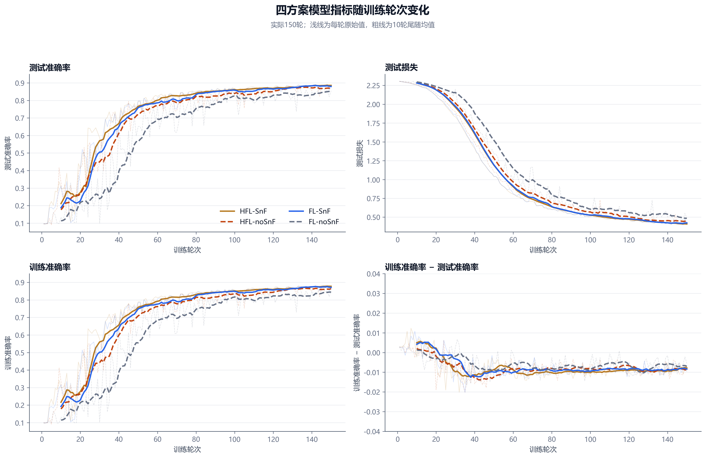
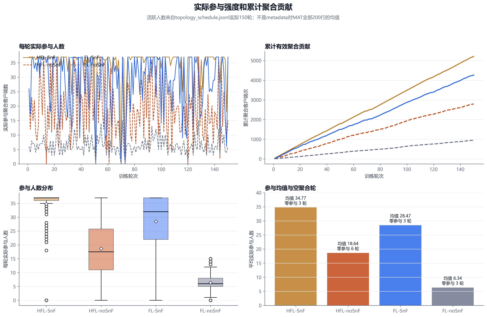
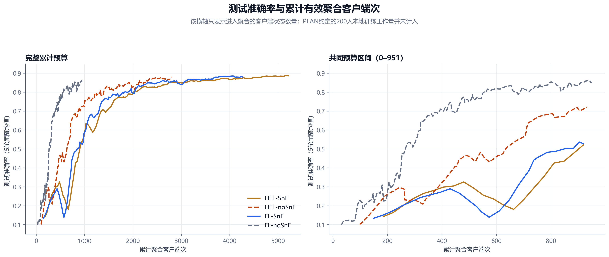
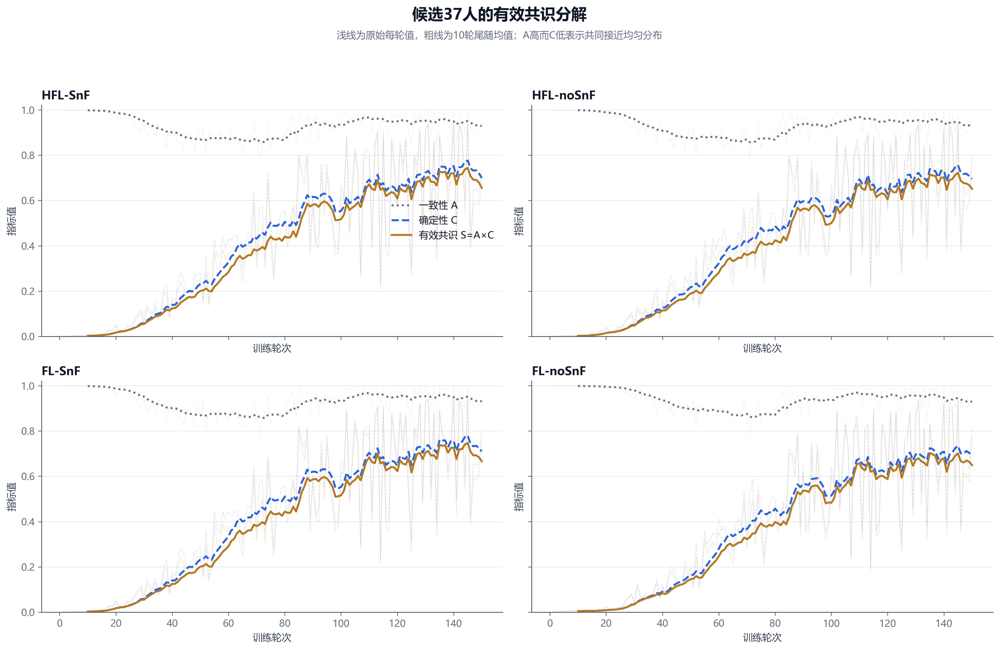
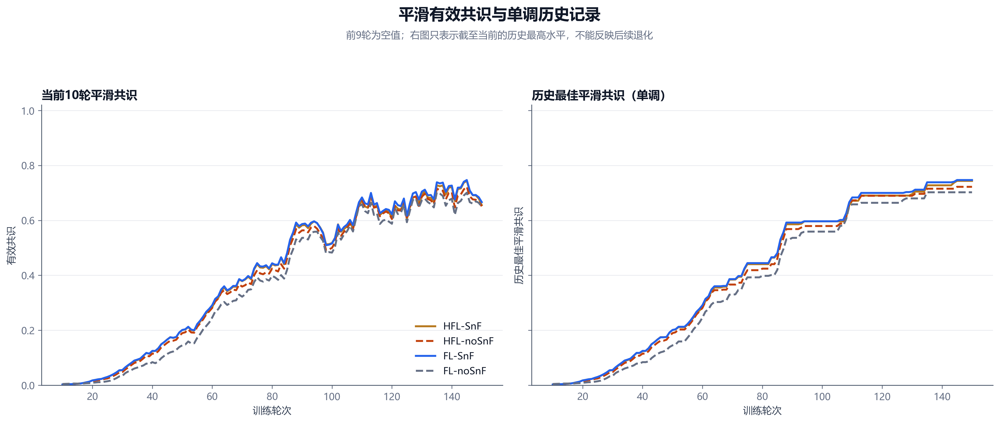
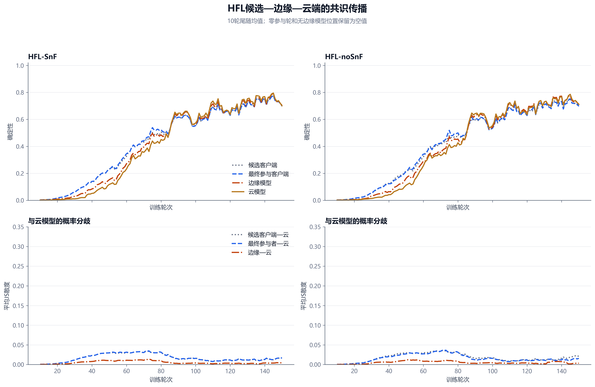
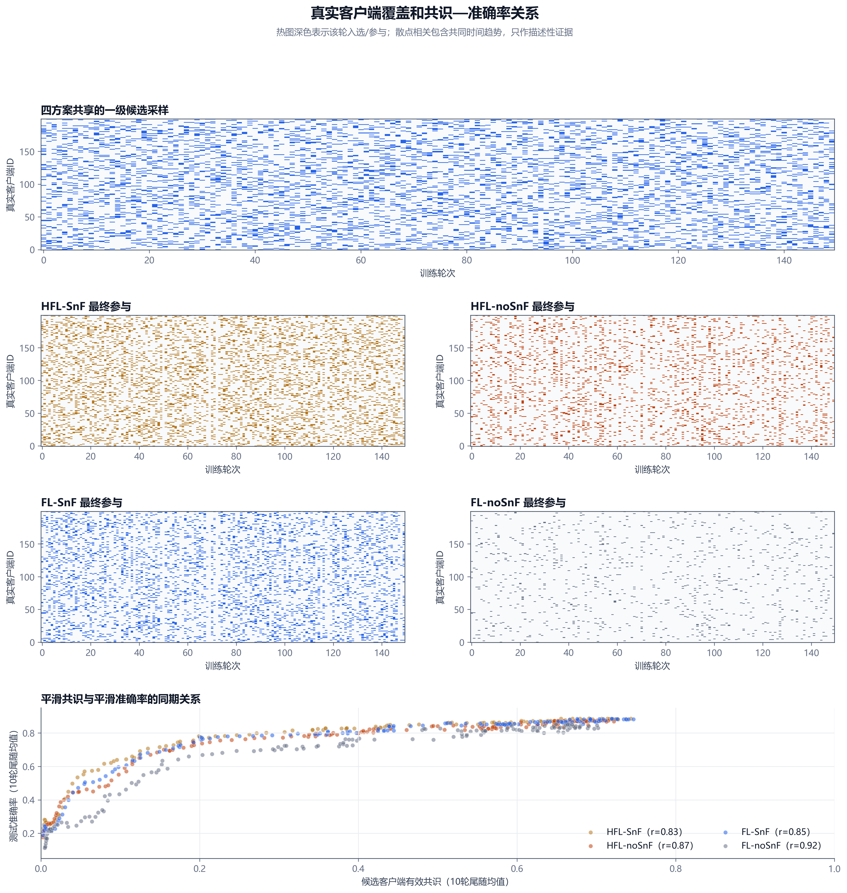

# 四组联邦学习实验结果分析报告

## 技术摘要

- **后期效果最好的方案是 HFL-SnF。** 它在最后10轮的平均测试准确率为 **88.57%**；后期最稳定的方案是 HFL-SnF，最后10轮标准差为 **0.51 个百分点**。
- **SnF方案在两种架构下都表现出更高的后10轮准确率，但不能解释成纯SnF因果效果。** HFL内差值为 **+1.326 个百分点**，FL内差值为 **+2.801 个百分点**；与此同时四场景平均参与聚合人数差异很大。
- **有效共识修正了“共同乱猜”的误判。** 四组前10轮的一致性A约为0.998，但确定性C只有约0.003，因此有效共识S接近0；后10轮S上升到约0.65。
- **证据评级：可分享但附带限制。** 600条调度记录和概率数据通过关键一致性检查，但只有单随机种子，结果没有运行代码哈希、模型快照或探针真值，而且当前代码与生成结果时的采样语义已经发生漂移。

## 1. 数据完整，但实际运行是150轮而不是200轮

四个结果目录的调度、四项模型指标和三份探针均为 **150轮**。元数据中的 `round_count=200` 表示MAT可用拓扑容量，`configured_comm_round=150` 和实际文件行数才是本次运行范围。目录名中的 `full200` 是实验标签，不能当成实际轮数。

数据质量检查共记录 43 项：无法验证4项，注意5项，通过34项。所有关键不变量均通过；“每轮全部200人完成本地训练”由于没有 `trained_client_indexes`，被标记为无法验证。

## 2. HFL-SnF后期准确率最高，本次运行中SnF同时降低后期波动

下表以最后10轮均值作为主要后期指标，同时保留最终值、峰值和基于5轮尾随均值的稳定达标轮次。单个最终epoch容易受当轮拓扑影响，因此不能只看最终一行。

| 方案 | 最终准确率 | 峰值 | 后10轮均值 | 后10轮标准差 | 稳定80% | 稳定85% | 稳定88% |
| --- | --- | --- | --- | --- | --- | --- | --- |
| HFL-SnF | 88.23% | 89.23% | 88.57% | 0.51个百分点 | 57 | 88 | 135 |
| HFL-noSnF | 88.23% | 88.91% | 87.24% | 1.76个百分点 | 74 | 119 | 未达到 |
| FL-SnF | 87.58% | 89.04% | 87.99% | 1.10个百分点 | 74 | 107 | 未达到 |
| FL-noSnF | 85.53% | 87.64% | 85.19% | 1.43个百分点 | 107 | 145 | 未达到 |

四组都没有稳定达到90%。HFL-SnF最后10轮平均准确率最高，且后期标准差最小；FL-noSnF的后期准确率最低，HFL-noSnF的后期波动最大。训练准确率与测试准确率非常接近，未观察到明显过拟合证据。

图中粗线为10轮尾随均值。SnF两条曲线的后期波动明显小于对应noSnF曲线，但参与规模不同仍是重要替代解释。

## 3. 四场景的有效聚合预算差异很大

| 方案 | 平均参与 | 范围 | 累计参与客户端次 | 零参与轮 | 最终参与覆盖 | 累计下发客户端次 |
| --- | --- | --- | --- | --- | --- | --- |
| HFL-SnF | 34.77 | 0–37 | 5216 | 3 | 200/200 | 29400 |
| HFL-noSnF | 18.64 | 0–37 | 2796 | 6 | 200/200 | 28800 |
| FL-SnF | 28.47 | 0–37 | 4271 | 3 | 200/200 | 29400 |
| FL-noSnF | 6.34 | 0–15 | 951 | 3 | 197/200 | 29400 |

如果PLAN中的“每轮200人本地训练”约定成立，四组本地训练工作量相同；上表统计的是**真正进入聚合的客户端状态数量**和下发次数。HFL-SnF在150轮累计聚合5216个客户端状态，而FL-noSnF只有951个，因此按轮次得到的性能差异同时包含拓扑、聚合层次和参与预算差异。

按轮次看，更多参与通常带来更快、更稳定的全局学习；按累计参与量看，FL-noSnF用更少的聚合客户端次达到较高准确率。后者不代表其总体方案更优，而是说明“每轮效果”和“单位上行聚合贡献效率”是两个不同问题。

## 4. 有效共识避免把均匀输出当成高共识

定义候选客户端平均概率为 $\bar p_t$，归一化熵为 $h(p)$。本报告使用：

$$A_t=1-\left[h(\bar p_t)-\frac1{37}\sum_i h(p_i^t)\right],\quad C_t=1-\frac1{37}\sum_i h(p_i^t),\quad S_t=A_tC_t.$$

| 方案 | 前10轮A | 前10轮C | 前10轮S | 后10轮S | 最高MA10 | 同期相关 | 差分相关 | 最强滞后 | 最强滞后相关 |
| --- | --- | --- | --- | --- | --- | --- | --- | --- | --- |
| HFL-SnF | 0.9980 | 0.0028 | 0.0028 | 0.6554 | 0.7436 | 0.835 | 0.007 | -10 | 0.877 |
| HFL-noSnF | 0.9983 | 0.0025 | 0.0025 | 0.6513 | 0.7221 | 0.868 | 0.005 | -10 | 0.909 |
| FL-SnF | 0.9980 | 0.0028 | 0.0028 | 0.6664 | 0.7468 | 0.848 | 0.008 | -10 | 0.888 |
| FL-noSnF | 0.9985 | 0.0046 | 0.0046 | 0.6490 | 0.7022 | 0.917 | -0.009 | -10 | 0.954 |

训练初期A接近1并不意味着模型已经形成有意义共识，而是所有客户端都输出接近均匀分布；C和S正确保持在接近0。四方案后10轮S都约为0.65，差异远小于参与规模差异，因此S更适合描述“当前预测是否既一致又确定”，不应单独用作算法优劣排名。

正滞后表示共识领先准确率；四组绝对相关最大值都落在搜索边界 -10 轮，即准确率领先共识约10轮的描述性信号。由于最优点卡在边界且两条序列都随训练时间上升，这一结果不能用于判断因果方向；一阶差分相关接近0也说明同期相关主要包含共同时间趋势。完整的 -10 至 +10 轮结果见 `共识准确率相关.csv`。

“历史最佳平滑共识”是截至当前轮的累计最高值，所以天然单调不降；它反映达成过的最好水平，却不会在模型退化时下降，必须和当前平滑S一起阅读。

## 5. HFL层级传播提高输出集中度，但不能证明预测正确

层级图按每轮JSONL的真实分组将37列候选探针映射到最终参与客户端，再与相同顺序的非空边缘探针对齐。边缘和云模型通常比客户端输出更集中，边缘—云JS分歧也较小；但是结果目录没有保存探针真实标签，因此高确定性和高共识仍可能是“共同预测错误”。

## 6. 一级采样公平覆盖200人，但二级参与覆盖随场景变化

四方案同一轮使用完全相同的37人候选顺序，150轮候选并集覆盖全部200个客户端；FL-noSnF最终只覆盖197人，其余三组覆盖200人。右下散点的同期相关包含共同时间趋势；报告同时计算一阶差分相关，避免把“都随轮次上升”直接解释成即时驱动关系。

## 7. 2×2比较只能作为端到端场景描述

| 对比 | 后10轮准确率差/百分点 | 最终差/百分点 | 平均参与人数差 |
| --- | --- | --- | --- |
| HFL中SnF增益 | +1.326 | +0.000 | +16.13 |
| FL中SnF增益 | +2.801 | +2.050 | +22.13 |
| SnF条件下HFL相对FL | +0.577 | +0.650 | +6.30 |
| noSnF条件下HFL相对FL | +2.052 | +2.700 | +12.30 |
| SnF增益的差分中的差分 | -1.475 | -2.050 | -6.00 |

差分中的差分为描述性结果，不是受控因果估计。原因是SnF/noSnF场景的MAT参与人数、非空边缘数量和累计聚合客户端次并不相同，而且每个方案只有一个随机种子。

## 8. 运行语义和可复现性限制

- 结果记录每个epoch重新抽取37人；当前 `trainer_test.py` 已改为实验开始时只抽一次固定候选，并且MAT模式只训练最终活跃客户端。
- 当前四份YAML配置为 200 轮，而本批结果元数据和文件均为 150 轮；当前配置不能直接复现这批结果。
- topology_metadata.json 的参与均值覆盖MAT全部200行；本报告改用JSONL实际150行重新计算。
- 结果没有保存完整运行配置快照、Git提交或代码哈希，也没有保存模型参数，无法独立复算“指标一定来自最终云模型”。
- 运行时MAT绝对路径已失效且没有文件哈希。本报告因此以JSONL中的实际分组为准，而不假设本地MAT与服务器文件字节一致。
- 每轮探针样本随epoch变化，共识曲线混合了模型学习进展与样本难度变化。
- 没有探针标签，不能区分正确共识和错误共识；没有可靠时间日志，不能比较训练耗时。
- 单随机种子不支持显著性检验、置信区间或稳定性外推。

## 9. 建议的下一步

1. 固化下一批实验的代码提交、完整YAML和MAT哈希，并为每轮日志增加 `trained_client_indexes`，消除训练语义无法验证的问题。
2. 使用相同候选序列、相同最终参与人数预算和至少5个随机种子重跑2×2消融，分别识别SnF、HFL层级和参与规模的影响。
3. 将探针改为固定的小批量样本并保存真实标签，分别报告正确共识、错误共识和样本难度分层结果。
4. 同时保留当前平滑有效共识S与历史最佳平滑共识，前者监控退化，后者记录达成进度。
5. 若目标是比较通信效率，应保存模型字节数、上行/下行次数和真实耗时；当前“累计客户端次”只能作为代理量。

## 10. 仍需进一步回答的问题

- 在严格匹配每轮参与人数后，SnF是否仍能带来1–3个百分点的后期准确率优势？
- HFL的提升来自边缘层聚合本身，还是来自更高的有效参与覆盖？
- 有效共识S在固定探针集上的变化是否仍与准确率同步，还是当前相关主要由样本难度和共同时间趋势造成？
- 当前代码的固定候选版本与本批每轮重采版本相比，会如何影响客户端公平性和最终精度？

本报告由 `analyze_experiment_suite.py` 从原始结果重新计算；可审计明细见同目录CSV和 `analysis_manifest.json`。
